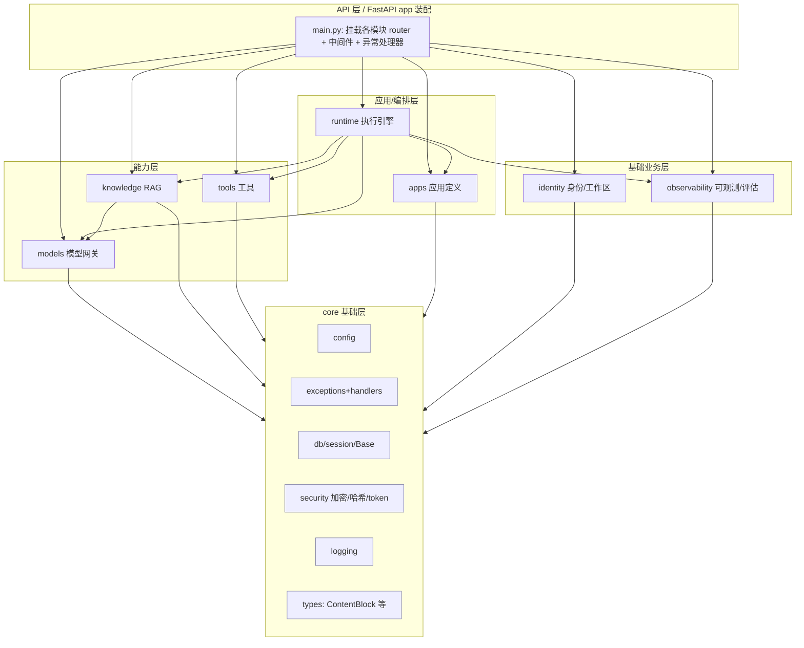
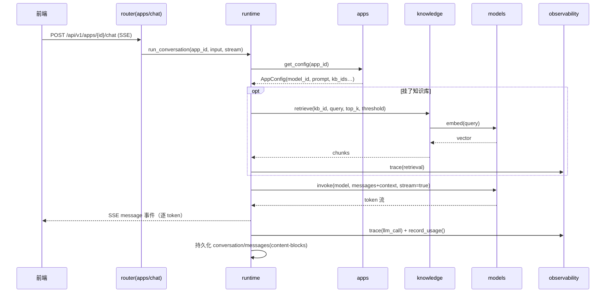
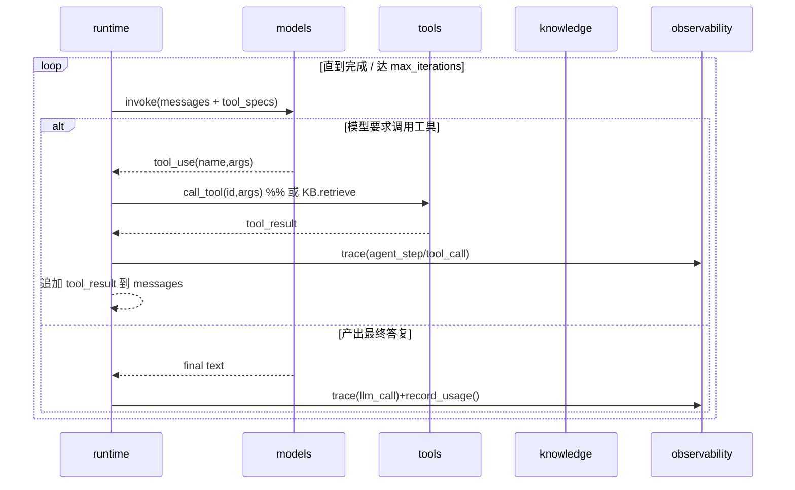
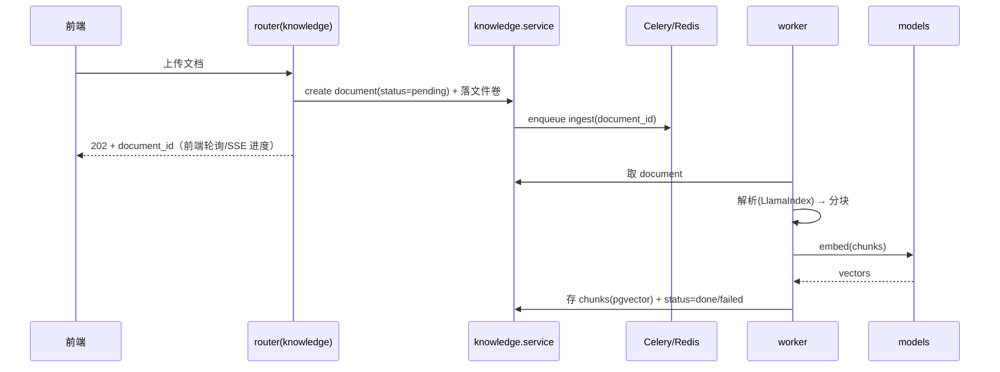

# agent-hify 总体设计文档

> 版本：v0.4（架构设计定稿）｜ 日期：2026-06-26
> 状态：架构设计已定稿，进入工程搭建
> 配套：[METHODOLOGY.md](./METHODOLOGY.md) · [CLAUDE.md](./CLAUDE.md) · [docs/competitive-brief-agent-platforms.md](./docs/competitive-brief-agent-platforms.md)

## 目录
1. 背景与目标
2. 竞品调研结论
3. 功能范围
4. 技术选型与编码规范
5. 总体架构（模块化单体 + core 基础层）
6. 模块职责边界、依赖分层与跨模块调用规范
7. 数据流向
8. 代码组织
9. 接口契约
10. 数据模型（定稿）
11. 索引策略（定稿）
12. 性能预判
13. 运维预期
14. 第一阶段 P0 范围
15. 错误处理与测试策略

> **方法论阶段映射**：§1–4、13=文字归档；§5–12=架构设计；行为指令见 CLAUDE.md；§14 起进入工程搭建/功能实现。

---

## 1. 背景与目标

用方法论驱动，落地一个**类 Dify、面向 50 人内规模**的 LLM 应用 / Agent 平台。**首要目标：方法论优先**——走通"问题界定→设计→实现→评估→迭代"闭环并沉淀。

## 2. 竞品调研结论（摘要）

详见 [competitive-brief](./docs/competitive-brief-agent-platforms.md)。编排/RAG/Agent/模型接入已饱和（正面重做必败）；**空白在"评估—可观测—迭代方法论闭环"**，作为差异化主张。不做通用自动化、不拼集成数量、不拼分发生态。

## 3. 功能范围

**第一版硬核**：模型管理（含视觉输入）→ 聊天助手 → RAG → 工具集成（MCP + 外部 API）→ Agent → 可观测基线 + 评估钩子。多模态限定为**视觉输入**。

**迭代版图（后续）**：Rerank · Prometheus · 多工作区(已预埋) · 细粒度 RBAC · 文档增量更新 · 文生图/音频 · embed iframe · 负载均衡/配额 · **工作流编排**。

---

## 4. 技术选型与编码规范

### 后端（Python）
| 项 | 选型 |
|---|---|
| 语言/运行时 | Python 3.12+，全量类型注解，`from __future__ import annotations` |
| Web 框架 | FastAPI（异步） |
| 模型网关 | LiteLLM |
| ORM/迁移 | SQLAlchemy 2.0（`Mapped[]` 类型化）+ Alembic |
| DTO/配置 | Pydantic v2 / pydantic-settings |
| DB | PostgreSQL 16 + pgvector |
| 异步 | Celery + Redis |
| RAG | LlamaIndex(仅解析/分块) + pgvector + 手写检索 |
| Agent | 手写 ReAct / function-calling 循环 |
| MCP | 官方 MCP Python SDK |

**编码规范（业界主流）**：
- **依赖管理**：`uv`（现代、快）+ `pyproject.toml`。
- **Lint+格式化**：`Ruff`（取代 black/isort/flake8，统一格式化与 lint）。
- **类型检查**：`mypy`（strict 倾向）。
- **测试**：`pytest` + `pytest-asyncio` + `httpx.AsyncClient`。
- **架构约束**：`import-linter`（CI 强制模块依赖分层，见 §6）。
- 命名：模块/函数 `snake_case`，类 `PascalCase`，常量 `UPPER_SNAKE`；Google 风格 docstring；12-factor 配置（全部走环境变量 → pydantic-settings）。

### 前端（React）
| 项 | 选型 |
|---|---|
| 构建 | Vite |
| 语言 | TypeScript（`strict: true`） |
| UI | Ant Design |
| 服务端状态 | TanStack Query |
| 路由 | React Router |
| 客户端状态 | 必要时 Zustand（v1 尽量不引入） |
| 流式 | SSE |

**编码规范（业界主流）**：
- **Lint/格式化**：ESLint（`typescript-eslint`）+ Prettier。
- **目录结构**：**feature-based（特性切片）**，而非按文件类型堆（见 §8）。
- **API 客户端**：**由后端 OpenAPI 自动生成 TS 类型与请求**（`orval` 或 `openapi-typescript`）——接口契约单一事实来源，杜绝前后端类型漂移（见 §9）。
- **测试**：Vitest + React Testing Library（组件冒烟为主）。
- 命名：组件 `PascalCase`、hook `useXxx`、路径别名 `@/`。

---

## 5. 总体架构（模块化单体 + core 基础层）

模块化单体：一个 FastAPI 应用，内部分**基础层 core** 与**有界业务模块**。core 提供横切基础设施（配置、异常、DB、安全、日志、公共类型），所有模块构建其上。业务模块只通过彼此的 `service` 接口通信。



> 取消了原 `console` 伪模块：**路由按模块就近放**（每模块 `router.py`），`app/main.py` 负责装配（挂载路由、中间件、异常处理器、OpenAPI）。"管理控制台"是前端概念，后端只暴露各模块 API。

---

## 6. 模块职责边界、依赖分层与跨模块调用规范

### 6.1 依赖分层（单向、无环）
层级越低越基础；**只能依赖更低层**。`observability` 是 L1 横切，允许被任意上层"向下"调用记录。

| 层 | 模块 | 依赖 |
|---|---|---|
| **L0 core** | config / exceptions / db / security / logging / types | 无（仅标准库与第三方） |
| **L1** | `identity`、`observability` | core |
| **L2** | `models`、`tools` | core, identity, observability |
| **L2'** | `knowledge` | core, identity, observability, **models** |
| **L3** | `apps` | core, identity（仅存配置，按 id 引用 models/kb/tools，不调用它们） |
| **L4** | `runtime` | core, apps, models, knowledge, tools, observability |
| **L5** | API 装配（main + 各模块 router） | 各自模块 service + core |

**关键无环设计**：`apps` 不依赖 `runtime`/`models`/`knowledge`/`tools`——它只持久化"配置"（`model_id`、`kb_ids`、`tool_ids` 等都是 id）。运行时由 `runtime` 读取配置并解析、调用各能力模块。

### 6.2 模块职责边界（拥有 / 不拥有）

| 模块 | 拥有（owns） | **不**拥有 | 对外接口（service）举例 |
|---|---|---|---|
| **core** | 配置、DB session、Base ORM、异常体系+处理器、加密/哈希/token、结构化日志、公共类型(ContentBlock/Page) | 任何业务数据 | `get_settings()`, `get_session()`, `encrypt()/decrypt()`, `AppError` 家族 |
| **identity** | users、workspaces、roles、登录会话 | 资源级归属（只盖 `created_by`） | `get_current_user()`, `require_role()`, `current_workspace()` |
| **models** | model_providers、models 注册表、加密凭证 | 会话/消息；模型"如何被用" | `invoke(ref, messages, stream)`, `embed(ref, texts)`, `test_connectivity(provider)` |
| **knowledge** | knowledge_bases、documents、chunks、摄取管线、检索 | 谁用哪个 KB（apps 配置）；生成式调用 | `retrieve(kb_id, query, top_k, threshold)`, `ingest(doc)`（异步） |
| **tools** | tools 注册表(builtin/api/mcp)、工具凭证、Tool 协议与调用 | 何时调用工具（runtime 决定） | `list_tools(ids)`, `call_tool(id, args)`, `get_specs(ids)` |
| **apps** | 应用定义+配置(chat/agent)、发布状态 | 执行；会话 | `get_config(app_id)`, CRUD |
| **runtime** | 执行引擎、ReAct 循环、content-block 组装、流式；**conversations、messages** | 各能力的配置（读自 apps/models 等） | `run_conversation(app_id, input, stream)`, `list_conversations(app_id)` |
| **observability** | traces、usage、annotations、评估钩子 | 业务数据 | `trace(...)`, `record_usage(...)`, `annotate(...)`, `run_eval_hook(...)` |

### 6.3 跨模块调用规范（强约束）
1. **只走 service 接口**：模块对外能力仅通过自身 `service.py` 的公开函数暴露；禁止 import 其他模块的 `repository.py` / `models.py`（ORM）/ 直接访问其表。
2. **跨边界只传 DTO**：参数与返回值只用 Pydantic schema 或基本类型，**不得跨模块传 SQLAlchemy ORM 实例**。
3. **持久化隔离**：每模块 repository 只碰自己的表；需要别家数据 → 调对方 service。
4. **单向无环**：依赖只能向下（见 §6.1），`import-linter` 在 CI 强制；唯一例外是任何模块可"向下"调用 `observability`（横切）。
5. **横切归 core**：配置/异常/DB/安全/日志/公共类型统一在 `core`，禁止各模块各造一套。
6. **路由薄**：`router.py` 只做鉴权+参数校验+调用本模块 service，不写业务、不跨模块编排；跨模块编排只发生在 `runtime`。
7. **异步任务**：模块通过 `worker` 中定义的 Celery 任务入队；任务体内调用模块 service（不跨边界直连 repository）。

---

## 7. 数据流向

### 7.1 聊天 + RAG（流式）


### 7.2 Agent（ReAct 循环）


### 7.3 文档摄取（异步）


---

## 8. 代码组织

### 后端（src 布局 + 模块内统一分层）
```
backend/
├─ pyproject.toml            # uv + ruff + mypy + pytest 配置
├─ alembic/                  # 迁移
├─ src/agent_hify/
│  ├─ main.py                # FastAPI 装配：挂载各模块 router、中间件、异常处理器
│  ├─ core/                  # L0 基础层
│  │  ├─ config.py           #   pydantic-settings
│  │  ├─ db.py               #   engine/session/Base
│  │  ├─ exceptions.py       #   异常体系 + FastAPI 处理器
│  │  ├─ security.py         #   哈希/加密/token
│  │  ├─ logging.py
│  │  ├─ pagination.py       #   Page[T]
│  │  └─ types.py            #   ContentBlock 等公共类型
│  ├─ modules/               # 业务模块（每个内部分层一致）
│  │  ├─ identity/  models/  knowledge/  tools/  apps/  runtime/  observability/
│  │  │   每个含: router.py  service.py  repository.py  schemas.py  models.py
│  └─ worker/                # Celery app + tasks
└─ tests/                    # 单元 + 集成
```
**模块内分层约定**：`router`(HTTP，薄) → `service`(业务，唯一对外入口) → `repository`(本模块表 ORM 操作)；`schemas`(Pydantic DTO，跨边界只传它) / `models`(SQLAlchemy ORM，模块私有)。

### 前端（feature-based）
```
frontend/
├─ src/
│  ├─ app/                   # 应用装配：router、Query Client、antd 主题、布局
│  ├─ features/              # 按特性切片
│  │  ├─ auth/  models/  knowledge/  apps/  chat/  observability/
│  │  │   每个含: api/(生成的 hooks 之上的封装)  components/  hooks/  types.ts  routes.tsx
│  ├─ shared/               # 跨特性复用：components(ui)、hooks、utils
│  ├─ lib/
│  │  └─ api/               # 由 OpenAPI 生成的 TS 客户端(orval 输出，勿手改)
│  └─ main.tsx
├─ orval.config.ts          # 指向后端 /openapi.json
└─ package.json
```

---

## 9. 接口契约

### 9.1 对外 HTTP API（OpenAPI 为单一事实来源）
- 后端用 FastAPI + Pydantic 定义 → 暴露 `/openapi.json` → 前端用 **orval** 生成 TS 类型与 TanStack Query hooks。**前端不手写接口类型**，从根上消除漂移。
- 风格：REST，资源化复数 URL，前缀 `/api/v1`；字段 `snake_case`；时间 ISO-8601 UTC。
- 鉴权：登录后 Bearer Token；除登录/health 外均需鉴权。
- **统一错误信封**：`{ "error": { "code": "...", "message": "...", "details": {} } }` + 恰当 HTTP 状态。
- **分页**：`?page=&page_size=`（默认 20）→ `{ items, total, page, page_size }`（`Page[T]`）。
- **流式（SSE）**事件：`message`(token) / `step`(Agent 步骤) / `usage` / `done` / `error`。
- 版本：路径 `/api/v1`，破坏性变更升版本。

### 9.2 模块间内部契约（Python）
- 以**类型化 service 函数 + Pydantic DTO** 通信；不跨边界传 ORM。
- 关键 DTO 与签名：
  - `ContentBlock`（联合类型，见 §10.2）。
  - `models.invoke(ref: ModelRef, messages: list[ContentBlock], stream: bool) -> InvokeResult`（`InvokeResult{ content, usage, finish_reason }`）。
  - `models.embed(ref: ModelRef, texts: list[str]) -> list[list[float]]`。
  - `knowledge.retrieve(kb_id, query, top_k=5, threshold=None) -> list[RetrievedChunk]`。
  - `tools.call_tool(tool_id, args: dict) -> ToolResult`；`tools.get_specs(ids) -> list[ToolSpec]`。
  - `observability.trace(type, input, output, metrics, status, **ctx)`。
- **错误契约**：core 定义异常基类 `AppError(code, message, http_status, details)`，子类 `NotFoundError/ValidationError/PermissionError/ExternalServiceError/RateLimitError`；各模块抛类型化异常，core 处理器统一转 §9.1 信封。错误码集中登记（如 `MODEL_AUTH_FAILED`、`KB_NOT_FOUND`、`TOOL_TIMEOUT`）。

### 9.3 扩展契约（插件机制）
- 新模型厂商：实现 Provider 适配器接口（或纯 LiteLLM 配置）。
- 新工具：实现 `Tool` 协议（`spec() -> ToolSpec`，`call(args) -> ToolResult`），内置/API/MCP 三类统一。

---

## 10. 数据模型（定稿）

**通用约定**：
- **主键**：自增 `bigint`（`generated always as identity`）。对外暴露的资源（如发布分享）另用随机 `share_token`，不直接暴露自增 id。
- **时间戳**：所有表含 `created_at`、`updated_at`（`timestamptz`，UTC）。
- **多工作区预埋**：所有顶层业务表含 `workspace_id`（FK，默认 `default`，UI 不暴露切换）。
- **枚举**：用字符串 + CHECK 约束（迁移友好，胜过 PG enum 的改动成本）。
- **JSON**：用 `JSONB`。
- **删除**：v1 物理删除（不做软删，YAGNI；级联见 FK）。

| 表 | 列（类型 / 约束） |
|---|---|
| `workspaces` | id PK; name text; （种子一条 `default`） |
| `users` | id PK; workspace_id FK→workspaces; email citext **UNIQUE(workspace_id,email)**; password_hash text; role text CHECK in(admin,member) |
| `model_providers` | id PK; workspace_id FK; type text CHECK(openai,anthropic,ollama,openai_compatible); name text; base_url text NULL; credentials_encrypted bytea; enabled bool default true; **UNIQUE(workspace_id,name)** |
| `models` | id PK; workspace_id FK; provider_id FK→model_providers ON DELETE CASCADE; model_key text; type text CHECK(llm,embedding,rerank); capabilities JSONB(default '[]'); embedding_dim int NULL（embedding 模型必填）; default_params JSONB; enabled bool; **UNIQUE(provider_id,model_key)** |
| `apps` | id PK; workspace_id FK; type text CHECK(chat,agent); name text; config JSONB(model_id,system_prompt,params,kb_ids[],tool_ids[],agent_strategy,max_iterations); status text CHECK(draft,published) default draft; share_token text UNIQUE NULL（发布分享用，随机串，非自增 id）; created_by FK→users |
| `knowledge_bases` | id PK; workspace_id FK; name text; embedding_model_id FK→models; config JSONB(chunk_size,overlap,top_k,threshold); **UNIQUE(workspace_id,name)** |
| `documents` | id PK; kb_id FK→knowledge_bases ON DELETE CASCADE; filename text; file_path text; status text CHECK(pending,processing,done,failed) default pending; error text NULL; char_count int default 0 |
| `chunks` | id PK; document_id FK→documents ON DELETE CASCADE; kb_id FK→knowledge_bases; content text; embedding **vector(N)**（N=部署级 embedding 维度，见 §11）; metadata JSONB; position int |
| `tools` | id PK; workspace_id FK; type text CHECK(builtin,api,mcp); name text; schema JSONB; credentials_encrypted bytea NULL; config JSONB; enabled bool; **UNIQUE(workspace_id,name)** |
| `conversations` | id PK; app_id FK→apps ON DELETE CASCADE; workspace_id FK; user_id FK→users NULL; title text |
| `messages` | id PK; conversation_id FK→conversations ON DELETE CASCADE; role text CHECK(user,assistant,system,tool); content **JSONB**(content-blocks，见 §10.2) |
| `traces` | id PK; workspace_id FK; conversation_id FK NULL; message_id FK NULL; app_id FK NULL; type text CHECK(llm_call,tool_call,retrieval,agent_step); input JSONB; output JSONB; tokens_in int; tokens_out int; cost numeric(12,6); latency_ms int; status text; error text NULL |
| `usage_daily`（用量汇总） | id PK; workspace_id FK; day date; app_id FK NULL; model_id FK NULL; tokens_in bigint; tokens_out bigint; cost numeric(14,6); requests int; **UNIQUE(workspace_id,day,app_id,model_id)** |
| `annotations` | id PK; message_id FK→messages ON DELETE CASCADE; label text; note text NULL; created_by FK→users |

### 10.2 消息 content-blocks（多模态/工具统一结构）
`messages.content` = JSONB 数组；内部统一表示，由 `models.invoke` 翻译成各厂商格式：
```json
[
  {"type":"text","text":"这张截图报什么错？"},
  {"type":"image","source":{"kind":"url","url":"..."}},
  {"type":"tool_use","id":"...","name":"http_request","input":{}},
  {"type":"tool_result","tool_use_id":"...","content":[{"type":"text","text":"..."}]}
]
```

---

## 11. 索引策略（定稿）

### 11.1 关系索引
- **所有外键建 btree 索引**：`workspace_id`、`provider_id`、`kb_id`、`document_id`、`conversation_id`、`app_id`、`model_id`、`created_by`。
- **复合索引（按高频查询）**：
  - `apps(workspace_id, type, status)` — 列表筛选
  - `documents(kb_id, status)` — 摄取状态看板
  - `messages(conversation_id, created_at)` — 拉取会话历史
  - `conversations(app_id, created_at desc)` — 会话列表
  - `traces(workspace_id, app_id, created_at desc)` — 可观测查询
  - `chunks(kb_id)` — 检索前置过滤
- **唯一约束**：见 §10 各表 UNIQUE（防重复 provider/kb/tool/用户邮箱）。
- JSONB 如需按键查询（如 `models.capabilities` 含 vision）可加 **GIN 索引**；v1 数据量小，按需再加。

### 11.2 向量索引（pgvector）
- `chunks.embedding` 用 **HNSW**（pgvector ≥0.5，质量/延迟均衡，免训练），操作符类 **`vector_cosine_ops`**（余弦相似）。
  ```sql
  CREATE INDEX ON chunks USING hnsw (embedding vector_cosine_ops)
    WITH (m = 16, ef_construction = 64);
  ```
  查询期可调 `SET hnsw.ef_search`（默认 40，召回不足时调高）。
- 备选 IVFFlat（需 `lists` 与训练），本项目规模 HNSW 更省心，**默认 HNSW**。
- 检索按 `kb_id` 过滤 + 向量近邻：`WHERE kb_id = :kb ORDER BY embedding <=> :q LIMIT :k`（`<=>` = 余弦距离）。

### 11.3 嵌入维度（重要约束）
pgvector 列维度固定，而不同 embedding 模型维度不同（如 1536 / 1024 / 768）。决策：
- **部署级统一一个 embedding 维度 N**（`core.config` 配置，默认 `1536`，对应常见 embedding 模型）；`chunks.embedding` 即 `vector(N)`。
- `models.embedding_dim` 记录每个 embedding 模型维度；创建知识库时**校验所选 embedding 模型维度 == N**，不匹配则拒绝。
- 想换不同维度模型 = 重建索引/迁移（列入运维注意事项），不在 v1 支持"多维度共存"（YAGNI，避免每维度一张表的复杂度）。

> ✅ 已定稿：embedding 维度默认 **1536** 且全局统一；换维度 = 迁移+重建索引（运维注意），v1 不支持多维度共存。

---

## 12. 性能预判（50 人内）

| 指标 | 预算 | 说明 |
|---|---|---|
| 峰值并发对话 | ~10–20 | FastAPI 异步胜任 I/O 密集流式 |
| 首 token | < 2s（主要是模型） | 我方编排开销 < 100ms |
| 非 LLM 接口 p95 | < 300ms | CRUD/配置 |
| RAG 检索 | < 200ms（语料 < ~10 万 chunk） | HNSW 索引；超量调 `ef_search`/分区 |
| 文档摄取 | 异步无硬 SLA，前端显进度 | 受 embedding API 限速；限单文件大小 |

**瓶颈认知**：延迟主要来自外部模型 API → 优化重心是 async 不阻塞、重活异步化、向量索引；而非微优化。扩展手段（迭代版图）：增 worker、HNSW 调参、读副本、独立向量库。

## 13. 运维预期（50 人内 / 单人维护）

| 维度 | 生产 | 调试/开发 |
|---|---|---|
| 部署 | 单机 Docker Compose 一键起 | 同左，可跑个人机 |
| 资源 | ~4–8 vCPU / 16GB / 50–100GB | **更低：~2 vCPU / 4–8GB**；LLM 走 API 不吃本机 |
| 备份 | pg_dump 定时 + 文件卷 | 可免 |
| 升级 | `git pull` → `compose up --build` → Alembic 迁移 | 同左 |
| 密钥 | 凭证加密存库 + 部署 `.env` | `.env` 本地 |
| 监控 | 结构化日志 + 用量统计 + health 探针 | 同左 |
| 可用性 | 非 HA，单实例 | — |

## 14. 第一阶段 P0 范围（地基）

**P0 = core 基础层 + identity + models + observability 基线 + 工程骨架**

1. 工程骨架：backend(uv/ruff/mypy/pytest) + alembic + Postgres(pgvector) + Redis + Celery + frontend(vite/ts/antd/orval) + Docker Compose 一键起。
2. **core**：config、db/session/Base、异常体系+处理器、security(加密/哈希/token)、logging、types、pagination。
3. `identity`：登录鉴权、单工作区种子、admin/member。
4. `models`：厂商/凭证(加密)、模型注册表(capabilities/embedding_dim)、`invoke`/`embed` 网关、连通性测试。
5. `observability` 基线：traces 表+记录、用量汇总、health 探针、评估钩子接口(占位)。
6. 可扩展骨架：Provider 适配器接口、`Tool` 协议定义、Celery 任务骨架、`import-linter` 契约。
7. 前端最小：登录、模型配置页、用量/trace 查看页（API 由 orval 生成）。

**完成判据**：控制台配置模型并测连通；经网关发起一次 LLM 调用并在 trace/用量看到记录；`import-linter`/ruff/mypy/pytest 全绿；Compose 一键起。

后续：P1 聊天助手 → P2 RAG → P3 工具 → P4 Agent → P5 可观测深化+评估 →（later）工作流编排。

## 15. 错误处理与测试策略

**错误处理**：core 定义 `AppError` 体系；厂商错误在 `models` 网关捕获归一；异步失败写 `documents.status=failed`+error 可重试；SSE 发 `error` 事件；Pydantic 入口校验；core 中央处理器统一转错误信封(§9.1)。

**测试**：单元(mock 外部) + 集成(测试 Postgres+pgvector、Celery eager) + 检索/评估(fixture KB)；遵循 TDD；`import-linter` 守依赖分层；前端组件冒烟。

---

## 已定稿决定（2026-06-26 确认）
1. **主键自增 `bigint`**；对外暴露资源用随机 `share_token`，不暴露自增 id。
2. **embedding 维度默认 1536、全局统一**；换维度 = 迁移+重建索引，v1 不支持多维共存。
3. **取消 `console` 模块**，路由按模块就近 + `main.py` 装配；跨模块复合编排归 `runtime`。
4. **跨模块调用 7 条强约束 + `import-linter` 强制**（§6.3）。
5. **前端接口类型由后端 OpenAPI 经 orval 生成**，不手写（§9）。
6. **向量索引 HNSW + 余弦**（§11.2）。
